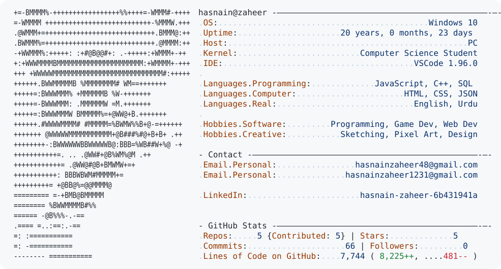

<picture>
  <source media="(prefers-color-scheme: dark)" srcset="./dark_mode.svg">
  <source media="(prefers-color-scheme: light)" srcset="./light_mode.svg">
  
</picture>

***
I am a Computer Science student who spends an unreasonable amount
of time turning ideas into projects.

I'm learning full-stack development, backend engineering, and
database design while building with React, Node.js, Express, and
PostgreSQL.

Outside the stack, I like experimenting with game development,
UI design, and making things that probably didn't need to be made.
***

### Languages

### Frontend

### Backend & Database

### Tools

### Creative and Game Dev

***
### Let's Connect

